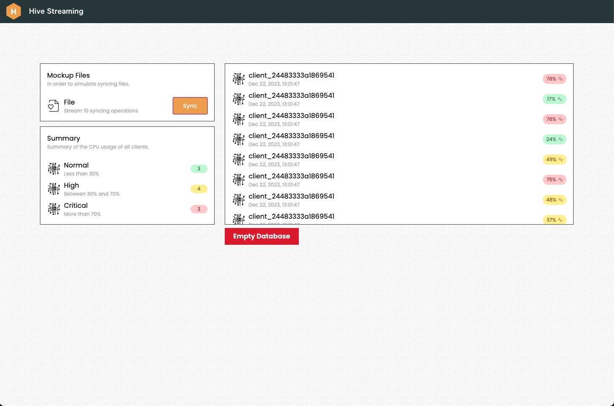

<p align="center" style="margin-top: 120px">
  <h3 align="center">Hive Streaming - Home Assignment</h3>
</p>



## About ℹ️

This is a simple web application that monitors the CPU usage of the machine it is running on. It is built with Next.js, Tailwind CSS and SQLite.

## Built with 🛠️

- [Next.js](https://nextjs.org/)
- [Tailwind CSS](https://tailwindcss.com/)
- [SQLite](https://www.sqlite.org/index.html)

## Getting Started 🚀

### Requirements

- [Node.js](https://nodejs.org/en/) >= 18.0.0
- [Yarn](https://yarnpkg.com/) >= 1.22.0

### Setup 🛠️

1. Clone the repository

   ```sh
   git clone https://github.com/aghsa97/hive-streaming.git
   ```

2. Install dependencies

   ```sh
   npm install
   # or
    yarn
   ```

3. Start the development server

   ```sh
    npm run dev
    # or
    yarn dev
   ```

4. Open [http://localhost:3000](http://localhost:3000) with your browser to see
   the result.

5. To run the tests

   ```sh
    npm run test
    # or
    yarn test
   ```

### Usage 📖

- You start by syncing 10 operations at a time by clicking the "Sync" button.
- You wait until syncing with the server is done. (You can follow up with the toasts that appear at the bottom of the screen)
- You can then see the CPU usage data that got inserted into the database in the table.
- You can also see the summary of Normal, High and Critical CPU usage in the summary section.
- You can Empty the database by clicking the "Empty Database" button. (NOTE: This will delete all the data in the database).

### Explanation of the code 📝

- The front-end code is built with Next.js and Tailwind CSS. The front-end code is divided into 3 main sections:

  - The `components` directory that contains all the components that are used in the application.
  - The `layout.tsx` file that contains the layout of the application.
  - The `page.tsx` file that contains the main page of the application.

- The back-end code is built with Next.js and SQLite. The back-end code is divided into 2 main sections:

  - The `app/api` directory that contains all the API routes that are used in the application.
  - The `db.ts` file that contains the database connection and the database schema.

- The `src/utils` directory that contains all the utility functions -helper functions-s that are used in the application.

### Choices I made 🤔

- I mocked the data that is being displayed in the application because I did not have access to a real CPU usage data source. In a real world scenario, I would have build a native application (or used Electron) that would have been able to access the CPU usage data of the machine it is running on.

- I picked React instead of Angular because I am more familiar with React and I have been using it for a while now. I would love to learn Angular in the future, but I did not have enough time to learn it for this assignment.

- If the data in the body that is sent to the API is not valid, the API will return a 400 Bad Request response, and the data will be dequed from the queue. I assumed that we do not want to store invalid data in the database.

- I chose to double the time between each retry because I do not want to send too many requests to the server if it is down.

- If the data can't be sent to the server after retrying 3 times, the data will be dequed from the queue. In real world scenario, if we have a native client we would want to store the data in a local database or a file and retry sending it to the server later. Otherwise, if we are using a web client, storing the data in web storage will lose us the data anyway if the user clears the browser cache or reboots.

- I chose HTTP over WebSockets because I assumed that we do not need real-time data. And I added a timeout of one second between each request to the server for demonstration purposes. In real world scenario, I would remove the timeout and send the requests as fast as possible.

- I made unit test for the API routes just to make sure that the API routes are working as expected. I did not make unit tests for the utility functions because they are very simple and they are not doing any complex logic.

- I did some server load testing using [Artillery](https://artillery.io/) to make sure that the API routes are working as expected. The server load testing results are in the `report.json` file -behaivded relativly good-. (NOTE: I can talk more about it in the interview if you want).

- "Empty Database" button is added for demonstration purposes.

### Improvements 🤩

- I would add a native client that would be able to access the CPU usage data of the machine it is running on.

- Securing the API routes with authentication and authorization.

- Adding unit tests and integration tests.

## Contact ✉️

- [LinkedIn](https://www.linkedin.com/in/mohammed-agha/)
- [Email](mailto:mohammed.agha977@gmail.com)
